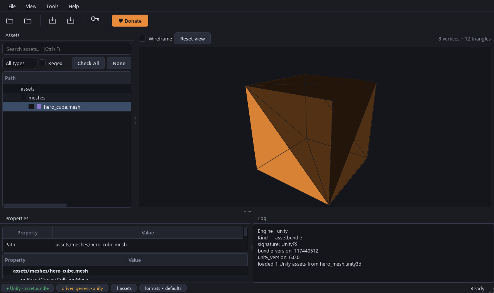
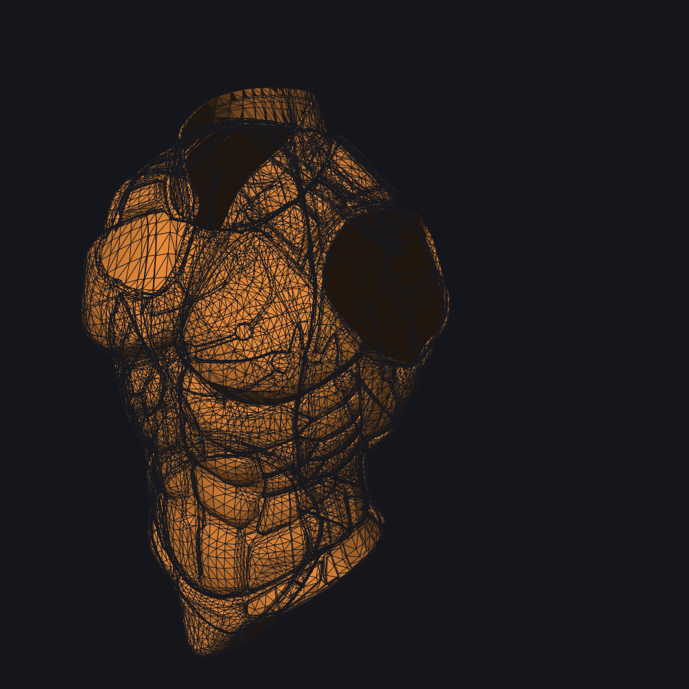
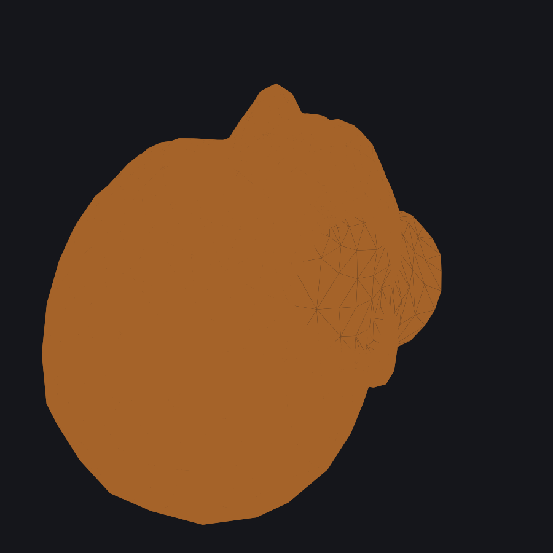

# DualForge

### Extract assets from **any** Unity or Unreal game — one tool, both engines.

**DualForge** is a modern desktop extractor and asset browser for Unity and Unreal Engine games.
Browse, preview, and export textures, meshes, audio, animations, and more — with full support for
encrypted archives, compressed bundles, and a built-in hex inspector for everything else.

   

> DualForge is **free to use**. Decryption and decompression happen entirely in-memory —
> it never patches, modifies, or redistributes game files or third-party DLLs.



Live 3D mesh previews (texture-mapped GLB, both engines):





---

## Installation

### From core drivers

```powershell
.\scripts\install.ps1                        # installs to %LOCALAPPDATA%\Programs\DualForge
.\scripts\install.ps1 -DesktopShortcut       # ...and adds a desktop shortcut
.\scripts\install.ps1 -InstallDir "D:\Tools" # custom location
```

Uninstall = delete the install folder (and the shortcut).

### From source (developers)

```powershell
git clone https://github.com/B6K3124/DualForge-Asset-Extractor.git DualForge
cd DualForge
python -m venv .venv
.\.venv\Scripts\activate
pip install -e .
python main.py
```

Optional extras:

```powershell
pip install -e ".[keys]"    # community key-endpoint sync (requests)
pip install -e ".[snappy]"  # snappy codec support
```

---

## Usage

Open an archive — **drag-and-drop** a `.pak`, `.utoc`/`.ucas`, or Unity bundle onto the window.
Click any asset to preview it, then **Extract All** to a folder or **Export Selected** for just the checked assets.

```
python main.py          # from source
dist\DualForge.exe      # from the build
```

| What you can do | Where |
|---|---|
| Browse a whole game directory | **File ▸ Open Folder** |
| Save and reload game sessions | **File ▸ Game Profiles** |
| Add / import / sync AES keys | **File ▸ Manage Keys** or **Settings** |
| Find keys in a game binary | **Tools ▸ Ghidra Key Hunt** |
| View per-type file statistics | **View ▸ Asset Statistics** |
| Switch dark / light theme | **View ▸ Theme** |
| Configure export formats (PNG/JPG/DDS/glTF/FBX/USD/JSON/video…) | **File ▸ Settings** |

### CLI

```powershell
# Detect a file
python main.py detect "game\Content\Paks\pakchunk0-Windows.pak"

# Extract all assets from a Unity bundle
python main.py extract "game_Data\sharedassets0.assets" -o out

# Extract with a format override (applied to every type that supports it)
python main.py extract "game_Data\sharedassets0.assets" -o out --format jpg

# Extract only certain Unity types, e.g. skinned meshes + animations as FBX
python main.py extract "game_Data\sharedassets0.assets" -o out --types Mesh AnimationClip --format fbx

# Export Cubemaps (one PNG per face) and VideoClips (original container)
python main.py extract "game_Data\sharedassets0.assets" -o out --types Cubemap VideoClip

# Export an AnimatorController / Avatar / LightmapData as JSON
python main.py extract "game_Data\sharedassets0.assets" -o out --types AnimatorController Avatar LightmapData

# Extract from an Unreal IoStore
python main.py extract "game\Content\Paks\pakchunk0-Windows.utoc" -o out

# Extract with a mappings file (unversioned UE5)
python main.py extract "game\Content\Paks\pakchunk0-Windows.utoc" -o out --usmap "game.usmap"

# Keys management
python main.py keys add "Game" 0123456789abcdef...
python main.py keys list
python main.py keys schemes
python main.py keys test "game.pak" --aes 0x...
python main.py keys import "Global.AESKeys.json"
python main.py keys sync

# Generate a mappings file from a running game
python main.py usmap dump --process "Game.exe" -o game.usmap

# Combine meshes into a USD world
python main.py world "game_Data\sharedassets0.assets" -o world.usd

# IL2CPP metadata
python main.py il2cpp inspect "global-metadata.dat"
python main.py il2cpp strings "global-metadata.dat" -o strings.txt

# Write-back: replace an asset and save to a new archive
python main.py repack texture "game_Data\sharedassets0.assets" "hero_0" "hero.png" -o repacked
python main.py repack font   "game_Data\sharedassets0.assets" "title"  "title.ttf"  -o repacked

# Locales: dump to JSON, edit entries, write back
python main.py locres dump "Game.locres" -o game.json
python main.py locres edit "Game.locres" "Menu.START=Begin" "Menu.QUIT=Exit" -o edited.locres
```

---

## Why DualForge

| Capability | **DualForge** | FModel | UABEA | AssetStudio | uTinyRipper |
|---|:---:|:---:|:---:|:---:|:---:|
| Unity bundles & serialized files | ✅ | – | ✅ | ✅ | ✅ |
| Unreal `.pak` (native read) | ✅ | ✅ | – | – | – |
| Unreal IoStore (`.utoc` / `.ucas`) | ✅ | ✅ | – | – | – |
| Oodle decompression | ✅ | ✅ | – | – | – |
| Multi-scheme AES + custom encryption | ✅ | AES | – | – | – |
| Generate `.usmap` from running game | ✅ | – | – | – | – |
| Ghidra key hunt | ✅ | – | – | – | – |
| Mesh / audio / texture / text previews | ✅ | partial | ✅ | ✅ | limited |
| Skeleton + animation export (glTF / FBX) | ✅ | ✅ | ✅ | ✅ | limited |
| Cubemaps / VideoClips / SpriteAtlases / Animators / Avatars | ✅ | – | – | ✅ | limited |
| Property inspector (MonoBehaviour) | ✅ | ✅ | ✅ | ✅ | limited |
| **Write-back / repack** | ✅ | – | ✅ | – | – |
| **USD world export** | ✅ | partial | – | partial | – |
| **IL2CPP metadata dump** | ✅ | ✅ | – | – | – |
| Headless CLI | ✅ | ✅ | – | – | – |

*FModel is Unreal-only; UABEA / AssetStudio / uTinyRipper are Unity-only.*

---

## Features at a glance

- **Any format** — `.pak`, `.utoc`/`.ucas`, `.assets`, `.unity3d`, `.bundle`, and more — auto-detected by magic bytes.
- **Encrypted archives** — multi-key AES with per-game scheme support; keys from manual entry, FModel import, or community sync.
- **Unity stream files** — `.resS`, `.resource`, `.split*`, `.resA`, `.resH` loaded automatically.
- **Texture decode** — PNG/JPG/BMP/WebP/TGA/DDS/KTX; **DDS/KTX1/KTX2 containers** decoded in pure Python (BC1–BC5, uncompressed).
- **Cubemaps** — every face decoded and exported as its own image (6-face PNG set).
- **3D preview** — wireframe + solid mesh viewer with skeleton overlay; Unreal (`.pak`) meshes are texture-mapped using baked base-color textures.
- **FBX export** — skinned meshes with skeletons, morph targets (BlendShapes) and animation clips, as **FBX 7.4 binary** (verified importing cleanly into Blender 5.2); ASCII still available via `DUALFORGE_FBX_ASCII=1`.
- **Audio preview** — waveform + inline playback (WAV/OGG/FLAC/raw, vgmstream for `.wem`).
- **Videos** — `VideoClip` / `MovieTexture` streamed back to their original container (MP4/MOV/WebM/…).
- **Sprite atlases** — every packed sprite exported individually.
- **Asset metadata** — `AnimatorController`, `Avatar`, `LightmapData` exported as readable JSON.
- **Write-back** — replace textures, fonts, and text assets, then save a new archive.
- **Locales** — `.locres` dump / edit / write-back with UTF-16 support.
- **Full hex inspector** — raw bytes for anything without a dedicated viewer.
- **Polished GUI** — dark & light themes, live search, drag-and-drop, extraction progress with cancel.
- **Headless CLI** — detect, extract, repack, locres, keys, usmap, crack, codecs.

---

## Supported formats

- **Archives**: Unreal `.pak`, IoStore `.utoc`/`.ucas`, Unity bundles (`.assets`, `.unity3d`, `.bundle`) + stream files, Bethesda BSA/BA2, nested zip / 7z / gzip / zstd / lz4 / lzma.
- **Compression**: zlib, gzip, bz2, lzma, LZ4, LZ4HC, Zstandard, Brotli, snappy, Oodle (Kraken/Mermaid/Leviathan), 7z.
- **Textures**: PNG, JPG, BMP, WebP, TGA, DDS, KTX — via Pillow + pure-Python block decoders.
- **Cubemaps**: 6-face PNG/JPG/TGA/DDS/KTX per-face export.
- **Videos**: `VideoClip` / `MovieTexture` → original container (MP4/MOV/WebM/AVI) or raw.
- **Audio**: WAV, OGG, FLAC, raw — plus vgmstream for `.wem`, `.fsb`, etc.
- **Meshes**: OBJ, glTF (skinned + skeleton), **FBX (skinned + morph targets)**, USD/USDA.
- **Animations**: FBX (default), glTF, JSON keyframe dump.
- **Asset metadata**: `AnimatorController`, `Avatar`, `LightmapData` → JSON summaries; `SpriteAtlas` → one image per packed sprite.
- **Text**: JSON, XML, plain text, MonoBehaviour type-tree inspector.

Full details: [`docs/COMPRESSION.md`](docs/COMPRESSION.md) · [`docs/COMPATIBILITY.md`](docs/COMPATIBILITY.md) · [`docs/USER_GUIDE.md`](docs/USER_GUIDE.md)

---

## Compatibility

DualForge is built around the *file formats*, not the games — so it keeps working
across engine generations. A per-archive best-effort engine version is shown in
the GUI (parsed from the bundle/serialized header or the pak footer).

### Unity

| | |
|---|---|
| Containers | `.assets`, `.unity3d`, `.bundle` + stream files (`.resS`, `.resource`, `.split*`, `.resA`, `.resH`) |
| Engines | Unity **2017 → current (Unity 6 / 6000.x)** — UnityPy reads the serialized/asset-bundle format, which is version-agnostic; DualForge never gates on the engine build |
| Verified | Unity 2021.3 (Raft, CarX, Tabletop Simulator) |

### Unreal

| | |
|---|---|
| Native `.pak` (pure Python) | pak v8B–v12 = **UE 4.17 – 5.8** |
| Via uex/CUE4Parse bridge | older pak footers + all IoStore (`.utoc`/`.ucas`); auto-probed EGame covers **UE3 → UE6.0** (footer-driven bands, `DUALFORGE_EGAME` to force) |
| Unversioned packages | UE5.3+ `.uasset` need a `.usmap` — auto-found in `~/.dualforge` / `DUALFORGE_USMAP`, or dumped from the running game |
| Encryption / compression | AES-256 natively, multi-scheme AES/custom via the bridge; Oodle unpacked with the game's own `oo2core_*.dll` (never bundled) |
| Verified | TEKKEN 8 (UE5, pak v12): 279,410 files / 100 archives; raw + texture + `.wem` extraction, skeletal & static **mesh preview** in the 3D viewport |

**Known gaps:** `.usmap` files must match the game build (re-dump after updates);
paks encrypted with fully custom schemes need their keys/scheme configured;
very old UE1/UE2 paks have no CUE4Parse engine and are best-effort only.

---

## Architecture

```
                 [ PySide6 GUI / CLI ]          main.py, dualforge/ui, dualforge/cli
                           │
                           ▼
                 [ Engine Detector ]             dualforge/detector  (magic bytes)
                           │
                 ┌─────────┴─────────┐
                 ▼                   ▼
            [ Unity Module ]    [ Unreal Module ]   dualforge/unity, dualforge/unreal
                 │                   │
                 └─────────┬─────────┘
                           ▼
            [ Decompression Core ]               dualforge/compression
                           │
                           ▼
              [ Export / Preview / Audio ]        dualforge/export, dualforge/ui/preview
```

---

## FAQ

**Is it free?** Yes — free to use. Donations via [Ko-fi](https://ko-fi.com/b6000) are appreciated but never required.

**Does it modify game files?** No. Everything happens in memory. DualForge is strictly read-only.

**Does it need the game installed?** No — point it at the game files you already have on disk.

**Windows-only?** The prebuilt build is Windows-only. Running from source on Linux/macOS may work but is untested.

**Known limitations:**
- IoStore requires the `uex`/CUE4Parse bridge (downloads native codecs on first use).
- Unversioned UE5 games need a `.usmap` — DualForge can generate one from a running game.
- Some fully custom protection schemes remain unsupported.
- Not every asset type has a dedicated previewer — raw export is always available.

---

## Support

DualForge is free. If it saved you time (or an entire weekend), a coffee is appreciated:

[](https://ko-fi.com/b6000)

---

## Legal

DualForge is released under the **MIT License** (see [`LICENSE`](LICENSE)). Third-party
libraries remain under their own licenses — see [`docs/LICENSES.md`](docs/LICENSES.md)
for the full license ledger.
You are responsible for the files you decrypt/extract and for obtaining the rights to them.
